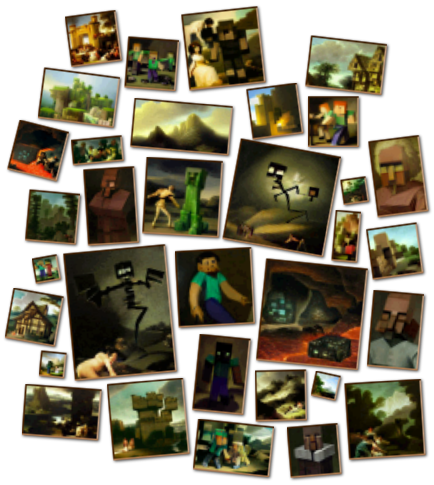

# Foreboding Paintings
_What if Francisco Goya had played Minecraft?_

This is a simple mod that adds additional paintings, supposedly in the style of [Francisco Goya](https://en.wikipedia.org/wiki/Francisco_Goya, "Francisco Goya"). These artworks were generated using [Craiyon](https://www.craiyon.com "Craiyon") by supplying various combinations of the words "Minecraft", "Oil Painting" and "Francisco Goya", as well as some subject-matter keywords. They were then automatically processed and cropped to better fit the in-game block resolution using [ImageMagick.](https://imagemagick.org "ImageMagick Site")

If you've been in the mood for some mildly-disquieting oil paintings for your Minecraft mansion, then this is the mod for you!

## Features
- A collection of mildly-unsettling, aged oil paintings!

## Attributions and Credits
- Original image files were generated using [Craiyon](https://www.craiyon.com "Craiyon").
- The original files were processed using [ImageMagick](https://imagemagick.org "ImageMagick Site"); some being manually cropped beforehand.

## License Information
- The code of this repository is licensed under the [MIT License](https://mit-license.org), as per the [License file](LICENSE) included in the repository.
- The images of this repository, being generated by [Craiyon](https://www.craiyon.com "Craiyon"), are subject to separate licensing under the provisions of the [Free Commercial License](https://www.craiyon.com/terms). Derivative works using the images in this repository must also be attributed to [Craiyon](https://www.craiyon.com "Craiyon"), and may be subject to other restrictions as provided by the aforementioned separate terms.
